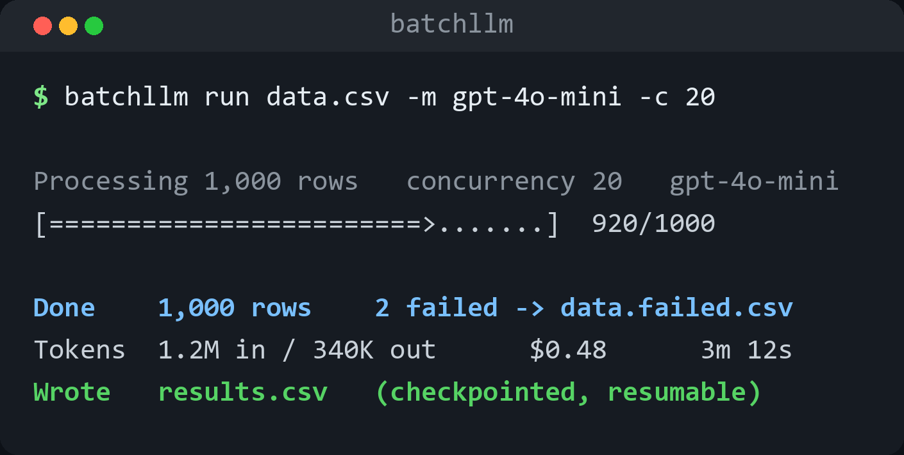

<div align="center">


[](https://pypi.org/project/batchllm/)
[](https://github.com/he-yufeng/BatchLLM/actions)
[](LICENSE)

[**Quick Start**](#quick-start) · [**Usage**](#usage) · [**Features**](#features) · [中文](README.zh-CN.md)

</div>

<p align="center"></p>

Feed BatchLLM a file of inputs, it fires them through any OpenAI-compatible API with concurrent requests, automatic retries, rate limiting, checkpointing, and cost tracking. Get a clean output file with results, token counts, and latency stats.

No more writing the same async retry loop for the hundredth time.

## Why?

Every data scientist who's done bulk LLM processing has written some version of this:

- Async request queue with semaphore-based concurrency
- Exponential backoff with jitter on rate limit errors
- Checkpoint/resume so you don't re-process 10k items after a crash
- Token counting and cost estimation before committing to a big job

BatchLLM packages all of this into a single CLI command and Python API.

## Features

- **Concurrent processing** — configurable parallelism with asyncio semaphore
- **Automatic retries** — exponential backoff, configurable max retries
- **Checkpoint/resume** — crash-safe JSONL checkpoints that reject mismatched inputs or model settings
- **Failure breakdown** — failed rows are tagged by cause (rate limit, auth, timeout, bad request, ...) so the summary tells you what to fix
- **Cost tracking** — real-time token counting with pricing for 30+ models
- **Pre-run estimate** — project rows, tokens, and cost offline, including what a checkpoint resume still has left to do
- **Smoke test with `--limit N`** — process just the first N rows to sanity-check a prompt before committing to the full job
- **Cost ceiling with `--max-cost`** — stop the run once the spend reaches a USD budget; pair it with `--checkpoint` to resume the rest later
- **Multiple input formats** — CSV, JSONL, plain text
- **Any OpenAI-compatible API** — OpenAI, Anthropic (via proxy), DeepSeek, local models, etc.
- **Prompt templates** — `{input}` plus any other CSV column / JSONL field as `{column}`, e.g. `"Translate {text} to {language}"`
- **Rich progress bar** — live progress with throughput and ETA

## Installation

```bash
pip install batchllm
```

## Quick Start

### CLI

```bash
# Basic: process a CSV file
batchllm run data.csv -m gpt-4o-mini

# With system prompt and template
batchllm run data.csv -m gpt-4o-mini \
  -s "You are a translator" \
  -t "Translate to French: {input}"

# Higher concurrency with custom output path
batchllm run data.csv -m gpt-4o-mini -c 20 -o results.csv

# Resume from checkpoint after interruption
batchllm run data.csv -m gpt-4o-mini --checkpoint data.ckpt

# Retry only failed checkpoint rows, while keeping successful results
batchllm run data.csv -m gpt-4o-mini --checkpoint data.ckpt --retry-failed

# Resumed rows still count toward the final token, latency, and cost summary
# Reusing data.ckpt with another input, model, prompt, or sampling config fails fast

# Smoke-test a prompt on the first 5 rows before the full run
batchllm run data.csv -m gpt-4o-mini -t "Summarize: {input}" --limit 5

# Stop once the run has spent $5, then resume the rest later from the checkpoint
batchllm run data.csv -m gpt-4o-mini --max-cost 5 --checkpoint data.ckpt

# Validate input format before spending money on API calls
batchllm validate data.csv --min-items 100

# Estimate cost before running
batchllm estimate data.csv -m gpt-4o

# Use any OpenAI-compatible API
batchllm run data.csv -m deepseek-chat \
  --base-url https://api.deepseek.com/v1 \
  --api-key $DEEPSEEK_API_KEY
```

### Python API

```python
import asyncio
from batchllm import BatchProcessor, BatchConfig

config = BatchConfig(
    model="gpt-4o-mini",
    system_prompt="Classify the sentiment as positive, negative, or neutral.",
    max_concurrent=15,
    max_retries=3,
)

processor = BatchProcessor(config)

items = [
    "This product is amazing!",
    "Worst purchase ever.",
    "It's okay I guess.",
]

results = asyncio.run(processor.process_items(items))

for r in results:
    print(f"{r.input_text[:30]}... -> {r.output_text}")
    print(f"  tokens: {r.tokens_in}+{r.tokens_out}, latency: {r.latency_ms:.0f}ms")
```

### File Processing

```python
import asyncio
from batchllm import BatchProcessor, BatchConfig

config = BatchConfig(
    model="gpt-4o-mini",
    prompt_template="Summarize in one sentence: {input}",
    max_concurrent=10,
    input_column="text",
    output_column="summary",
)

processor = BatchProcessor(config)
results = asyncio.run(
    processor.process_file(
        "articles.csv",
        output_path="summaries.csv",
        checkpoint_path="articles.ckpt",
    )
)
```

## Input Formats

**CSV** — reads from a configurable column (default: `input`):
```csv
input,category
"This movie was great",review
"Terrible service",complaint
```

**JSONL** — reads from a configurable field:
```jsonl
{"input": "This movie was great", "category": "review"}
{"input": "Terrible service", "category": "complaint"}
```

BatchLLM fails fast if the configured CSV column or JSONL field is missing. That is intentional: a batch job should not silently turn bad input into thousands of empty prompts.

### Multi-field templates

Every other column (CSV) or field (JSONL) is available to the prompt template as `{column}`, alongside `{input}`. So a `reviews.csv` with `text,language` columns can drive:

```bash
batchllm run reviews.csv -m gpt-4o-mini \
  --input-column text \
  -t "Translate this review to {language}, then summarize it in one line: {text}"
```

Unknown placeholders are left untouched (literal braces in a template won't break the run), and substitution is single-pass so a value that itself contains `{...}` is never re-expanded.

You can check the input without calling a model:

```bash
batchllm validate data.csv --input-column input --min-items 100
```

**Plain text** — one item per line:
```
This movie was great
Terrible service
```

## Output Format

Output mirrors input format with added columns:

```csv
input,output,error,error_type,tokens_in,tokens_out,latency_ms
"This movie was great","Positive sentiment","","",15,3,234.5
"Terrible service","Negative sentiment","","",12,3,198.2
```

For rows that failed after exhausting retries, `error` holds the message and
`error_type` holds a category (`rate_limit`, `auth`, `timeout`, `connection`,
`bad_request`, `conflict`, `server`, or `other`), so you can filter the output
straight to the rows worth re-running.

## When Rows Fail

A run rarely fails all at once for the same reason. When some rows don't make
it through their retries, the summary groups the failures by cause so you know
whether to back off, fix a key, or look at the input:

```
        Failure Breakdown
┌───────────────────┬───────┐
│ Cause             │ Count │
├───────────────────┼───────┤
│ Rate limit (429)  │    42 │
│ Timeout           │     6 │
│ Bad request (4xx) │     1 │
└───────────────────┴───────┘
```

The categories survive checkpointing, so a resumed run still reports the
failures it carried over from the previous attempt.

## Estimate Before Running

Dry-run a job to see how big it is and what it will cost, without touching the API:

```bash
$ batchllm estimate data.csv -m gpt-4o -s "You are concise" -t "Summarize: {input}"
```

```
                       Run Estimate
┌────────────────────┬───────────────┐
│ Metric             │ Value         │
├────────────────────┼───────────────┤
│ File               │ data.csv      │
│ Model              │ gpt-4o        │
│ Rows               │ 10,000        │
│ Est. input tokens  │ ~1,420,000    │
│ Est. output tokens │ ~1,250,000    │
│ Est. cost          │ $16.05        │
└────────────────────┴───────────────┘
```

Tokens are sized with a transparent heuristic — roughly 4 characters per token plus
the usual per-message chat overhead — applied to the *fully rendered* prompt, so your
template and system prompt are included. No tokenizer download, no network, no API
calls. Output is projected as a 1:1 ratio of the input by default; tune it with
`--output-ratio` or cap it with `--max-tokens`.

Point it at a checkpoint and the estimate only counts the rows still left to run, so
you see what a resume would actually spend:

```bash
$ batchllm estimate data.csv -m gpt-4o --checkpoint data.ckpt
```

```
│ Rows               │ 10,000        │
│ Already done       │ 6,200         │
│ Previously failed  │ 130           │
│ Remaining          │ 3,800         │
│ Est. cost          │ $6.09         │
```

By default the failed rows are treated as already accounted for, matching a plain
resume. Add `--retry-failed` to count them as work still to do, the same way
`run --retry-failed` does.

## Supported Models (Cost Tracking)

Includes pricing for 30+ models:

| Provider | Models |
|----------|--------|
| OpenAI | gpt-5, gpt-5-mini, gpt-5-nano, gpt-4o, gpt-4o-mini, o3, o3-mini |
| Anthropic | claude-opus-4-7, claude-sonnet-4-6, claude-haiku-4-5 |
| Google | gemini-2.5-pro, gemini-2.5-flash, gemini-2.0-flash |
| DeepSeek | deepseek-chat, deepseek-reasoner |
| Mistral | mistral-large-latest, mistral-small-latest |

Custom pricing can be passed via the Python API.

## Configuration

| Option | CLI Flag | Default | Description |
|--------|----------|---------|-------------|
| model | `-m` | gpt-4o-mini | Model name |
| system_prompt | `-s` | None | System prompt |
| prompt_template | `-t` | `{input}` | Prompt template |
| max_concurrent | `-c` | 10 | Max parallel requests |
| max_retries | `--max-retries` | 3 | Retries per item |
| max_tokens | `--max-tokens` | None | Max output tokens |
| temperature | `--temperature` | None | Sampling temperature |
| api_key | `--api-key` | env `OPENAI_API_KEY` | API key |
| base_url | `--base-url` | env `OPENAI_BASE_URL` | API base URL |

## Roadmap

Concurrency, checkpoint/resume, retries, and cost control are solid. The next steps are about what a batch can carry and where it can live:

- **Structured output mode** — validate each row's response against a JSON schema and write a structured column, so a batch can feed straight into the next step instead of being re-parsed.
- **More input/output formats** — read and write Parquet and JSON arrays alongside CSV/JSONL, for batches that live in a data pipeline rather than a flat file.
- **Per-row model routing** — let a column choose the model per row, so one run can send the hard rows to a stronger model and the rest to a cheaper one.
- **A live progress view** — a compact view of throughput, spend, and failure rate while a long run is in flight, not just the summary at the end.

## Contributing

```bash
git clone https://github.com/he-yufeng/BatchLLM.git
cd BatchLLM
pip install -e ".[dev]"
pytest
```

## Related projects

- [TokenTracker](https://github.com/he-yufeng/TokenTracker) — a drop-in LLM cost tracker
- [PromptDiff](https://github.com/he-yufeng/PromptDiff) — semantic diff for LLM prompts

## License

MIT
